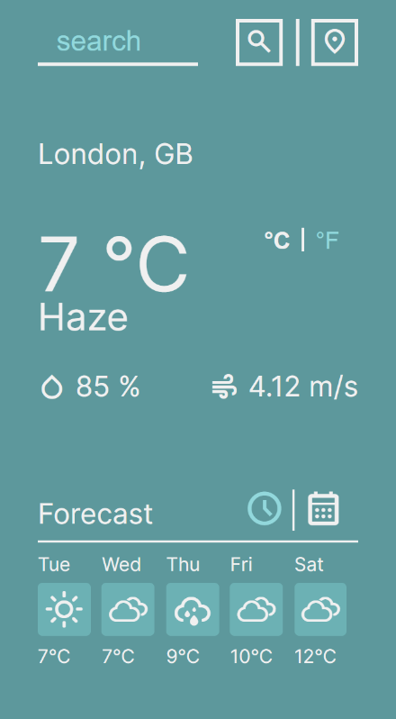

### Weather App
A simple web app showing current weather and forecast made with OpenWeather API.
I made it in order to practice working with 3rd party API's and asynchronous JavaScript.

### Screenshots

### How to run it?
Run the `npm init` and `npm run start` commands in the project directory to check it out.